# Lists & Sets

This exercise is compromised of multiple tasks. Complete all of them.

##

## Task 1

###

### 1.1

Write a Java program to create a new `List` of `String`. Populate the list with your favorite
colors (at least 5).

Iterate through the list and print out the result:

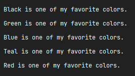

###

### 1.2

Go ahead and add new values to the list. Add a new value at **the beginning of the list**, as well
as another one in the **4th** position. Print the result:

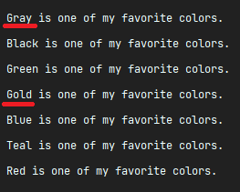

###

### 1.3

Now, first remove the element of **3rd** position and update the one in the **5th** position with a
different one. Print the result:

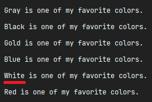

###

### 1.4

Swap the **1st** element with the **5th**. You can make use of the `Collections` class:

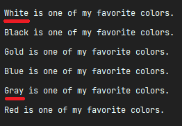

###

### 1.5

Now, **sort** the list alphabetically in **ascending order**. You can also make use of the
`Collections` class here:

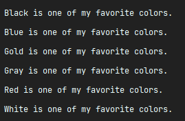

###

### 1.6

Finally, **sort** the list again but this time in **descending order**:

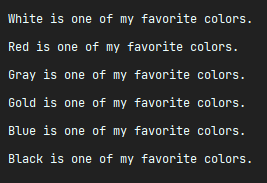

##

## Task 2

Write a Java program to create a new `List` of `Integer`. Populate it with **at least 10 numbers**
of your choice (both positive and negative numbers).

Without any other class' support, write a method that receives the list and prints out the smallest
and the biggest numbers from the list.

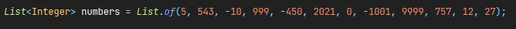

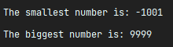

##

## Task 3

Now we'll check `Sets`.

Write a Java program to create **two** `Sets` of `Strings`. Populate them with:

```java
Set<String> languages1=Set.of("CSS","C#","HTML","Java","JavaScript","Swift");
    Set<String> languages2=Set.of("C#","Java","JavaScript","PHP","Python","Ruby");
```

Now, write 4 functions that implement the following mathematical operations on them:

###

### 3.1

Check if set `languages2` is a [subset](https://en.wikipedia.org/wiki/Subset) of set `languages1`.

###

### 3.2

Create a [union](https://en.wikipedia.org/wiki/Union_(set_theory)) of sets `languages1` and
`languages2`.

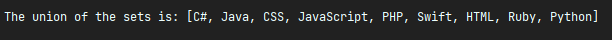

###

### 3.3

Create the [intersection](https://en.wikipedia.org/wiki/Intersection_(set_theory)) of
sets `languages1` and
`languages2`.

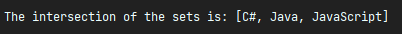

###

### 3.4

Create the [difference](https://en.wikipedia.org/wiki/Symmetric_difference) of sets `languages1` and
`languages2`.

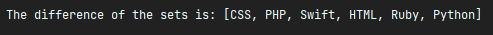